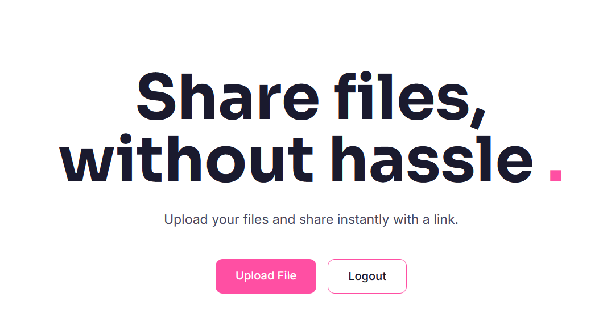

# TransFree

Een website waar je files kan uploaden en downloaden

## Project Status

We hebben op dit moment de core upload en download functionaliteiten volledig geïmplementeerd en werkend.
We werken ook actief om een comment systeem toe te voegen voor geüploade files.
Op dit moment, zijn er geen onvoltooide features behalve de lopende comment systeem implementatie.

## Beveiligingsmaatregeling

- Sessie protectie bij upload.
- Sessie protectie bij download.
- Integriteit checks bij upload/download.

## Test Resultaten

De core upload en download functionaliteiten werken, maar er zijn nog steeds meerdere bruikbaarheden verbeteringen gepland:

- De "get started" knop veranderd op dit moment niet wanneer een user is ingelogd.
- Er is op dit moment geen visuele indicatie dat een user is ingelogd.
- Eeen gebruiker kan nog niet uitloggen.
- Geüploade bestanden geven niet duidelijk aan of het succesvol is geüpload of niet.
- Na het uploaden, hebben gebruikers aleen een link die ze handmatig moeten kopiëren inplaats van een "kopiër link" knop.
- Gebruikers kunnen op dit moment niet vorige geüploade bestanden terug zien op bijvoorbeeld een dashboard.
